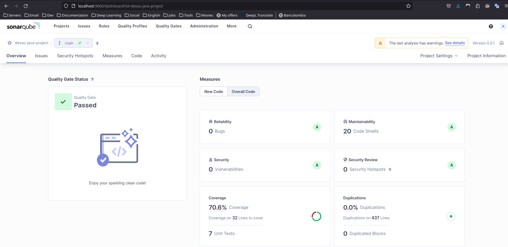

# Demo Devops Pipeline con Jenkins, Sonarqueb y Snyk

En el presente documento se describe el proceso de CI/CD implementado sobre el proyecto utilizando las herramientas:
- Jenkins
- Sonarqube
- Jacoco
- Snyk
- Docker
- Kubernetes

## Prerequisitos

- Java Version 17
- Spring Boot 3.0.5
- Maven
- Docker y Kubernetes (Puede ser Docker desktop habilitando Kubernetes)
- Jenkins (puede ser en contenedor, en sisguiente link se describe su instalación https://www.jenkins.io/doc/book/installing/docker/)
- Sonarqube comunity (puede ser en contenedor, en el siguiente link se desribe su instalación https://docs.sonarsource.com/sonarqube/latest/setup-and-upgrade/install-the-server/)
- Cuenta Docker HUB
- Cuenta Snyk
- Cuneta de GitHub con el repositorio y webhook creado apuntando hacia proyecto de Jenkins

## Diagrama General

A continuación se presenta el diagrama general de la implementación del pipeline CI/CD

## Stages del Pipeline

### Build Stage

En esta etapa se contruye el artefacto .jar teniendo en cuenta lo siguiente:
- En el código fuente se realizan cambios en el archivo src/main/resources/application.properties definiendo variables en los campos listados a continuación , de tal manera que sean tratados como secretos dentro de jenkins para no exponer data sensible:
  - Datasource URL
  - Database User
  - Database Password 
- Se crean los secretos en Jenkins con la información sensible
  
- Se definen variables dentro del environment del stage para obteber la información de los secretos en jenkins
- Se implementa la funcion Make para realizar los cambios de tags implementados en código por los valores de los secretos
- Se ejecuta el comando de compilación

A continuación se muestra el resultado de la primera etapa

### Test Stage

En esta etapa se ejecutan las pruebas y se realiza el reporte de Coverge, el cual sera analizado en las siguientes etapas.
Para esta etapa se tienen las siguientes consideraciones:
- Se implementa el plugin JaCoco para la generación del reporte de covertura
- Se ejecuta el comando de pruebas

A continuación se muestra el resultado de la segunda etapa

### Static code Analysis & Coverage stage

En esta etapa se hace uso del Sonarqube para realizar el análisis estático de código y cobertura, ya con el reporte de Jacoco contruido en la etapa anterior
#### Prerequisitos
 - Es importante recordar que en esta etapa, debe estar configura el plugin de Sonarqube en jenkis y configurado para que se enlace al servidor sonar destinado
 - Adicionalmente debe estar configurado el quality gate, el cual se encargará de determinar las condiciones para permitir avanzar en el pipeline de acuerdo a los criterios que se establezcan
 - Finalmente, debe configurarse el webhook que informará a jenkins el resultado del análisis de código y debe estar apuntado hacia el servidor de jenkins (http://url-jenkins/sonarqube-webhook)
 - Es recomendado que el webhook se configure con secreto adicional para mayor seguridad

#### Ejecución
La ejecución se realiza en dos etapas:
- Se ejecuta el comando de ánalisis de código
- se configura un tiempo de espera para recibir los resultados del sonar con respecto al quality gate configurado para continuar o detener el pipeline

A continuación se muestran los resultados de la etapa

Finalmente los resultados obtenidos en el análisis

### Vulnerability scan stage

En esta etapa se realiza el escaneo de vulnerabildiades a través de Snyk. Snyk clasifica las vulnerabilidades encontradas en 4 severidades:
- Criticas
- Altas
- Medias
- Bajas

En esta etapa se debe definir el criterio de aceptación en base a las clasificaciones descritas anteriormente.
El resultado de la etapa se muestra a continuación

### Build Image stage

En esta imagen se utiliza el plugin de docker para la contrucción de la imagen utilizando el archivo Dockerfile previamnete configurado.
El resultado de la etapa se muestra a continuación:

### Push Image stage

En esta etapa se carga la imagen generada al dockerhub definido en el archivo Jenkinsfile.
Es importante aclarar que la carga de la imagen se realiza con un tag que permita identificar de que contrucción se realizo utilizando la variable predefinida de Jenkins "BUILD_NUMBER"

El resultado de la etapa se muestra a continuación

### Deploy stage

Etapa final donde se despliega el servicio al cluster de kubernetes utilizando el plugin Kebernetes CLI y los manifiestos ubicados en la carpeta k8s
Algunas consideraciones en el momento del despliegue

- La configuración del deployment cuenta con las siguientes configuraciones:
  - Se crea un Namespace único para la aplicación llamado devsu
  - El deployment utiliza la variable de Jenkins BUID_NUMBER para identificar la imagen que se despliga en el Pipeline
  - El deployment cunata con anotaciones de revisiones que permiten identificar hasta 10 versiones anteriores con su numero de compilación para facilitar los procesos de rollback en caso de ser necesario
    
- Se implementas los resursos de ingress, hpa y service teniendo en cuenta lo siguiente:
  - El service se configura tipo CusterIP
  - El ingress define la url de acceso, es preferible que se cuenten con los servicios de cert manager con su cluster Issuer, así como del external DNS para manejo de registros y el Ingress COntroller
  - para el correcto funcionamiento de hpa, es recomendable verificar o instalar el servicio Kube-state-metrics en el cluster de destino
  - Se define un endpoint de salud para implementar los healthches respectivos.  
    Para ello se desarrolla un nuevo endpoint con la función única de verificar si el servicio esta operando y si hay conexión a la base de datos.  
  - Los archivos creados para el healthcheck con:  
    - src
      - main/java/devsu/devops/demo/
        - controller
          - HealthCheckController
        - Repository
          - HealthCheckRepository
        - Service
          - HealthCheckService
          - HealthCheckServiceImpl
  |
    
El resultado de esta etapa se visualiza a continuación:

## Resultados Pipeline

Se adjuenta en la carpeta doc el archivo pipeline-output.txt con el resultado de todo el pipeline implementado
